# Deliverable 2

1. My VM settings.
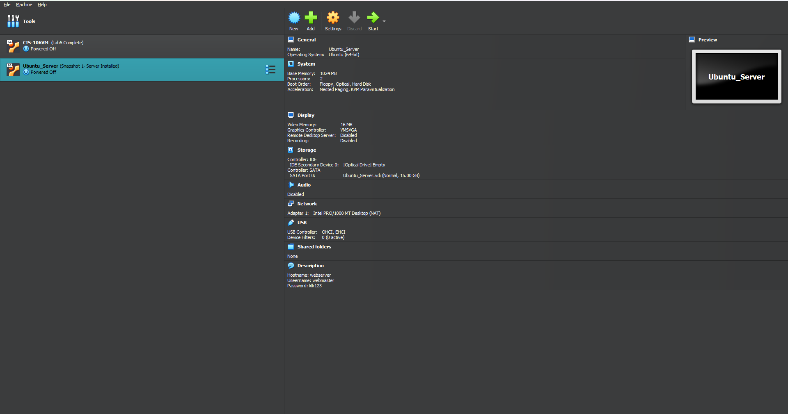 

2. Screen after login.
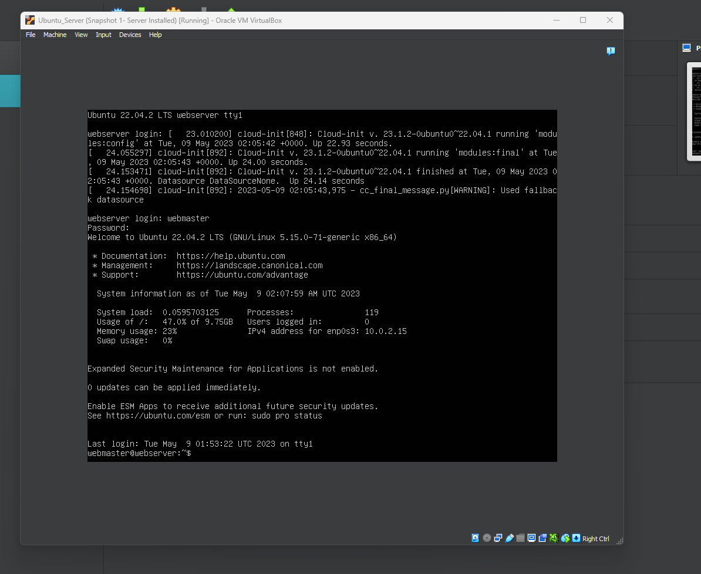 

3. Using ssh-login
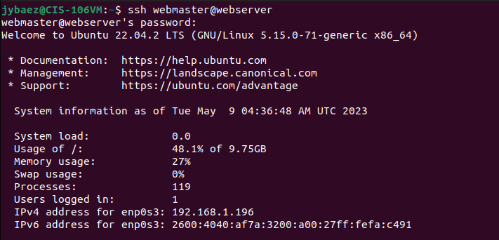 

4. Systemctl status apache 2 --no-pager command
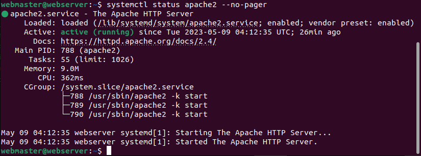 

- Systemctl status sshd --no-pager command
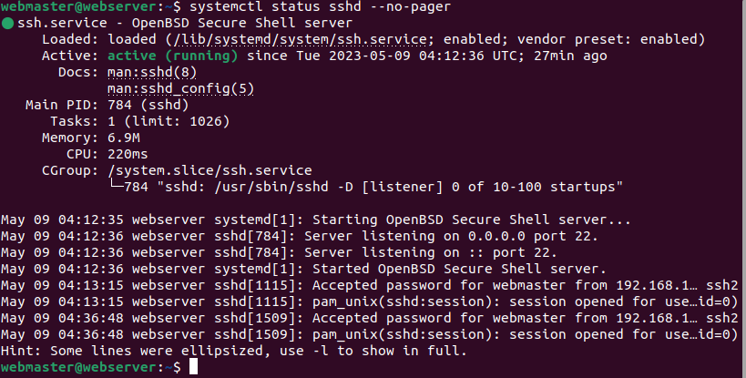 

- Systemctl status ufw --no-pager command
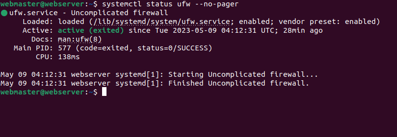

5. Apache access logs
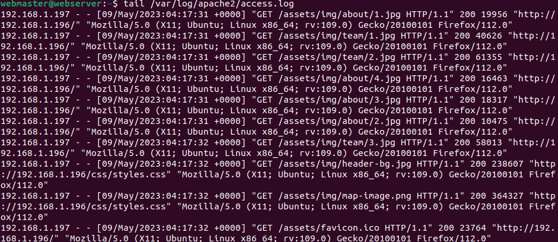 

- Apache error logs
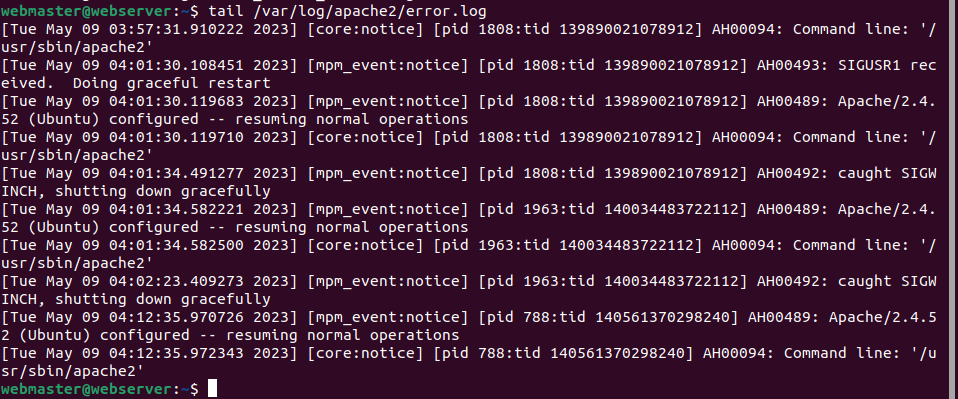 

- SSH authorization logs
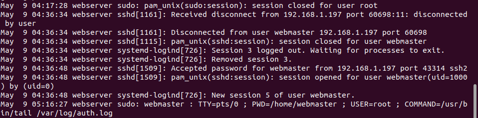 

6. Site-available config file
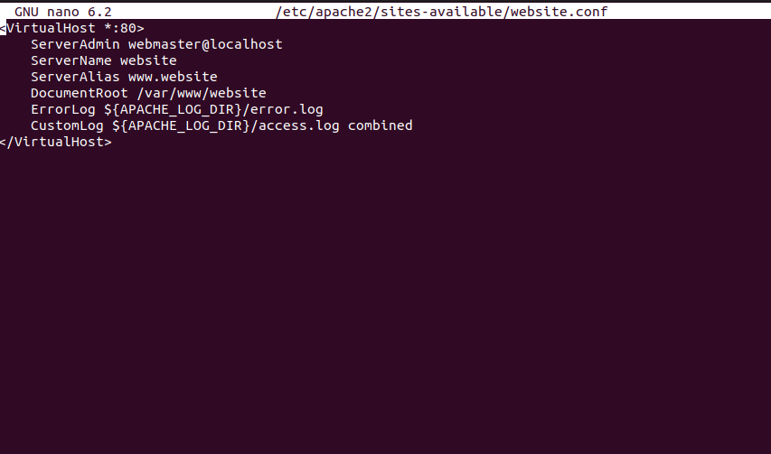 

- Apache2.conf 
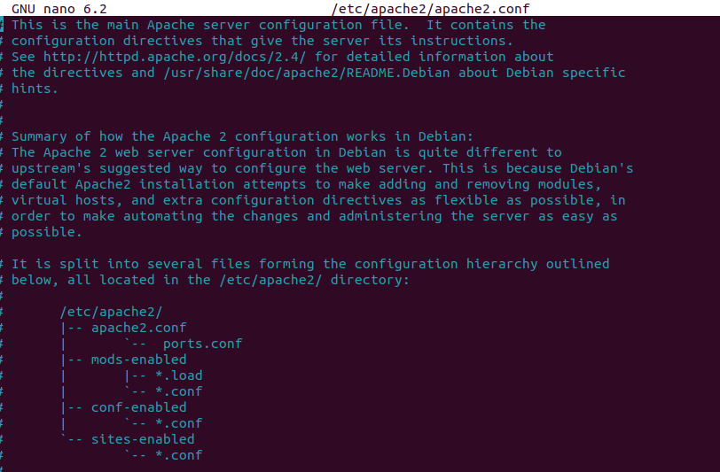 

7. Accessed website and Ip address
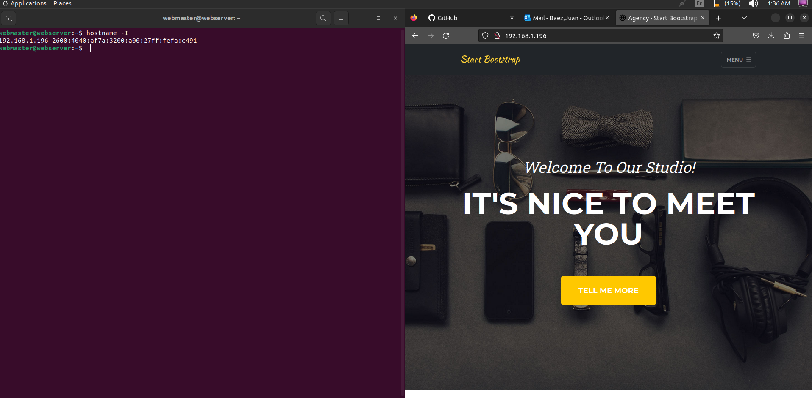