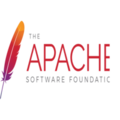
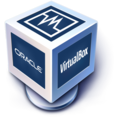
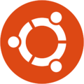

# Deliverable 1

## Basic Terminology

### What is a web server?
- On the hardware side, a **web server** is a computer that stores web server software and a website's component files like HTML, CSS stylesheets, and JavaScript files. On the software side a **web server** includes several parts that control how web users access hosted files.

### What are some example web server applications?

| Application Name | license      | Project's Website                       |
| ---------------- | ------------ | --------------------------------------- |
| Apache           | Apache 2.0   | [Apache.org](https://httpd.apache.org/) |
| Nginx            | 2-clause BSD | [Nginx.com](https://www.nginx.com/)     |
| Caddy            | Apache 2.0   | [Caddy.com](https://caddyserver.com/)   |

#### Apache
 
An ***Apache Server*** is a web server application that delivers content such as HTML pages, multimedia and CSS Style sheets over the internet. 

#### Nginx
 
***NGINX*** is a free, open-source, high-performance HTTP server and reverse proxy, as well as an IMAP/POP3 proxy server. NGINX is known for its high performance, stability, rich feature set, simple configuration, and low resource consumption.

#### Caddy
 
***Caddy*** obtains and renews TLS certificates for your sites automatically. Its novel certificate management features are the most mature and reliable in its class. 

### What is virtualization?
- ***Virtualization*** is technology that you can use to create virtual representations of servers, storage, networks, and other physical machines.

### What is virtualbox?
 
- ***Oracle VM VirtualBox*** is cross-platform virtualization software. It allows users to extend their existing computer to run multiple operating systems including Microsoft Windows, Mac OS X, Linux, and Oracle Solaris, at the same time.

### What is a virtual machine?
- A ***Virtual Machine*** is a compute resource that uses software instead of a physical computer to run programs and deploy apps.

### What is Ubuntu Server?
 
- ***Ubuntu Server*** is a server operating system, developed by Canonical and open source programmers around the world, that works with nearly any hardware or virtualization platform.

### What is a firewall?
- A ***firewall*** is a network security device that monitors traffic to or from your network.

### What is SSH?
- ***SSH***, also known as Secure Shell, is a network protocol that gives users, particularly system administrators, a secure way to access a computer over an unsecured network.

## Other Concepts
- **Index**: An index is sorting data by creating keywords or a list with pointers to where further information about the keyword is found.

- **Dependencies**: Dependency is a relationship between software components where one component relies on the other to work properly.

- **TLS encryption**: Transport Layer Security (TLS) is an encryption protocol that protects Internet communications. 

- **SSL encryption**: SSL, or Secure Sockets Layer, is an encryption-based Internet security protocol.

- **Systemd**: Systemd is the modern replacement for the legacy Linux initialization systems, System V (SysV) and Linux Standard Base init (LSB init).

- **Init system**: Init is the first process started during system boot.

- **Systemctl**: The systemctl command is a utility which is responsible for examining and controlling the systemd system and service manager.

- **Encapsulate**: The term encapsulation is used to describe a process of adding headers and trailers around some data.

- **Umask value**: A four-digit octal number that UNIX uses to determine the file permission for newly created files.

- **Nano**: Nano is an easy to use command line text editor for Unix and Linux operating systems.