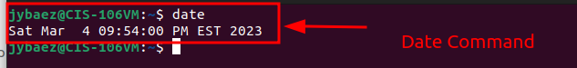
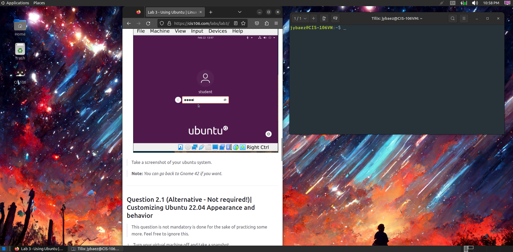

# Lab 3 Installing Ubuntu Submissions

## Question 1

## Question 2

## Question 3

| Program purpose     | Package Name | Version                |
| ------------------- | ------------ | ---------------------- |
| Play a tetris game  | blockattack  | 2.7.0-1                |
| Play a video file   | dragonplayer | 4:21.12.3-0ubuntu1     |
| Browse the internet | dillo        | 3.0.5-7build1          |
| Read your email     | geary        | 40.0-2                 |
| Play music          | deepin-music | 6.0.1.54+ds.1-2builds1 |

## Question 4

| command | what it does                                                                 |
| ------- | ---------------------------------------------------------------------------- |
| echo    | prints line of text                                                          |
| fortune | prints random quotes                                                         |
| cowsay  | prints picture of cow say something provided by the user or something random |
| lolcat  | prints text in different colors                                              |
| figlet  | prints larger characters using ordinary screen characters                    |
| toilet  | prints larger colourful                                                      |
| rig     | generates a random identity                                                  |