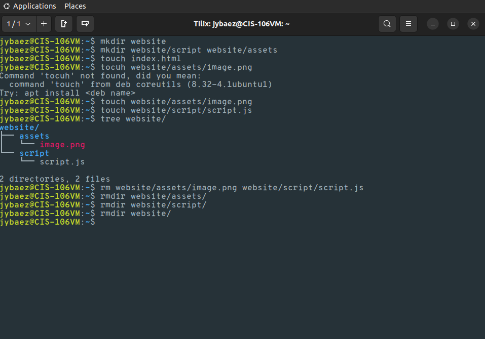
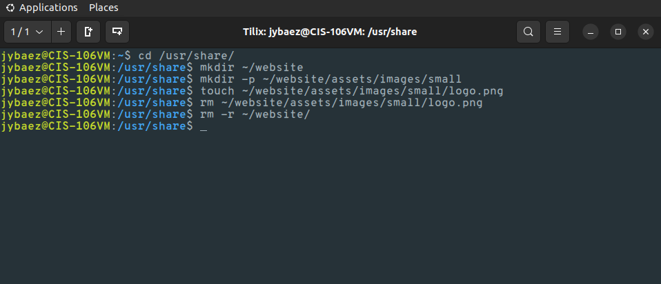
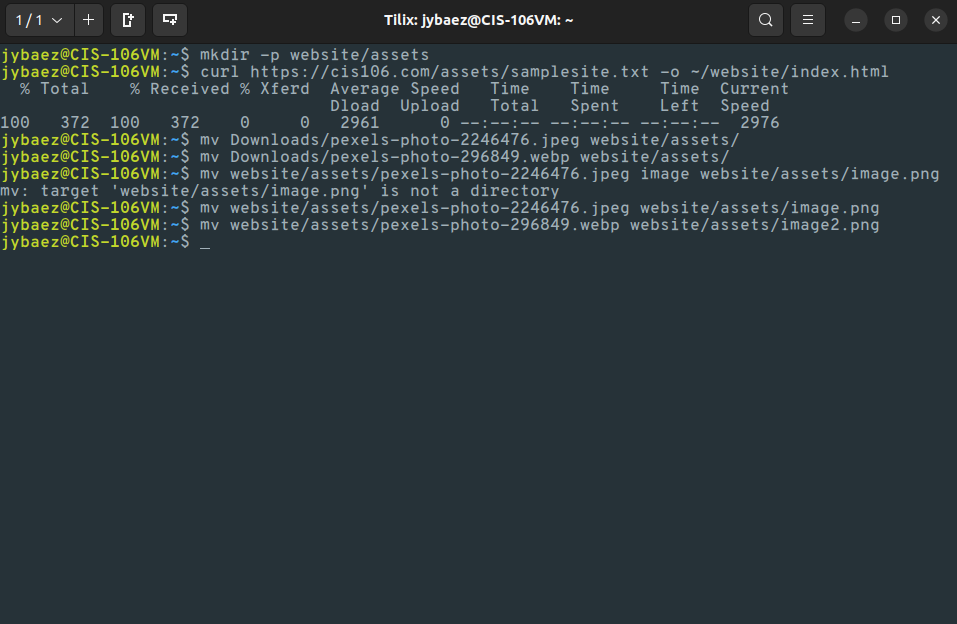
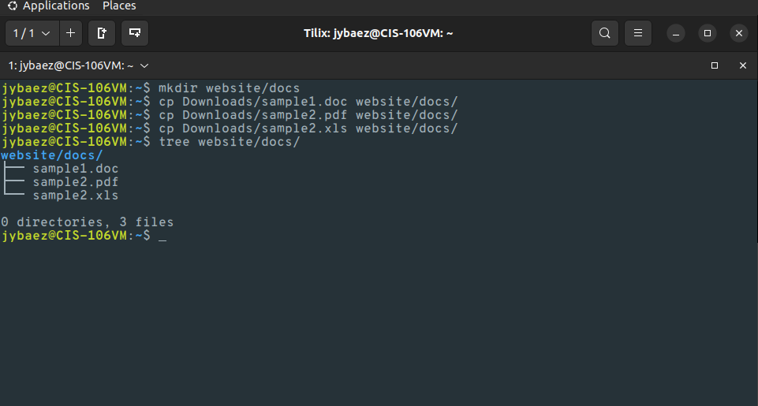

# Week report 5 

## Answer to questions:

* **What are Command Options?**
Options modify/enhance a commands behavior. 

* **What are Command Arguments?**
The items that open which the command acts on.

* **Which command is used for creating directories? Provide at least 3 examples.**
The command for creating directories is `mkdir`.
  * ***Example 1:***
    Create a directory: `mkdir wedding`
  * ***Example 2:***
    Created multiple directories: `mkdir ~/Downloads/games ~/Documents/Homeworks`
  * ***Example 3:***
    Create directory with a parent directory: `mkdir -p Pets/Dogs`

* **What does the touch command do? Provide at least 3 examples.**
The **touch** command allows you to create files.
  * ***Example 1:***
    Create a file: `touch report`

  * ***Example 2:***
    Create multiple files: `touch book_report1.txt book_report2.txt`

  * ***Example 3:***
    Create a file us with a space in its name: `touch "Command Cheat Sheet.txt"`

* **How do you remove a file? Provide an example.**
To remove a file you use the `rm` command.
  * ***Example:***
    Remove a file: `rm book_report1`

* **How do you remove a directory and can you remove non-empty directories in Linux? Provide an example**
To remove a directory you use the `rmdir` command. Yes you can remove a non-empty directory in linux but you have to use `rm -r`.
  * ***Example 1:***
    Remove an empty directory: `rmdir wedding`

  * ***Example 2:***
    Remove non empty directory: `rm -r Pets`

* **Explain the mv and cp command. Provide at least 2 examples of each**
The **mv** command moves and renames directories. The **cp** command copies files or directories from a source to a destination.
  * ***Examples of `mv` command:***
    Move a file from a directory using relative path: `mv Documents/cats.png Pictures/`
    Rename a file: `mv book_report2.txt final_report.txt`

  * ***Examples of `cp` command:***
    Copy a file: `cp Downloads/wallpapers.zip Pictures/`
    
    Copy the content of a directory to another directory: `cp Downloads/wallpapers/* ~/Pictures/`

## Practice 1
 
## Practice 2
 
## Practice 3
 
## Practice 4
